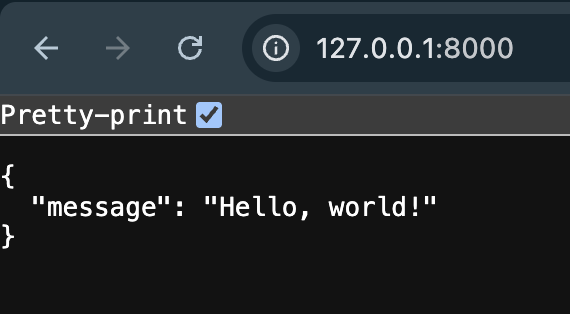

# First API Endpoint

A minimal FastAPI server with two JSON endpoints, built as a first exercise in the request → response loop.

## Endpoints

- `GET /` — returns `{"message": "Hello, world!"}`
- `GET /health` — returns `{"status": "ok"}`

## Run it

```bash
python3 -m venv venv
source venv/bin/activate
pip install -r requirements.txt
uvicorn main:app --reload
```

Then visit `http://127.0.0.1:8000/` or `http://127.0.0.1:8000/health` in your browser, or call it with curl:

```bash
curl http://127.0.0.1:8000/
curl http://127.0.0.1:8000/health
```

## Screenshot


